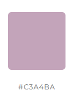

# Jessy's Journeys

Link to a live site https://xhesjana1.github.io/Jessy-s-Journeys/

## INTRODUCTION

This website is my first project with Code Institute as part of my Full Stack Development Course.

Jessy's Journal is a web application designed to offer users a chance to win a free trip to one of my top four travel destinations. As someone passionate about traveling, I understand that not everyone has the opportunity to explore the world the way I have.

Through this website, users can browse my top travel destinations and participate in a giveaway for a free trip by following me on social media. This not only helps grow my social media presence but also allows me to give an incredible 7 day trip experience to a lucky winner.

## Creater Experience

Creator Goals
* I want my webpage to be functional.
* I want my users to navigate the nav bar easly
* I want the purpose of my webpage to be clear.
* I want my webpage to be user-friendly.
* I want all participants to be able to complete the form and all the 5 fields are mandatory so no detials are missed when user subbmits the form.

Target Audience

* Individuals who may not have the financial means to travel but dream of exploring new places.
* Social media users who enjoy travel content and giveaways.

## User Experience Design

User Goals
* Easily navigate the webpage.
* Easily participation in a giveaway for a free trip.
* Easily find Jessy's top travel destinations.
* Easy and clear instruction to learn more about Jessy and the date of the give away and duration of the trip.

User Flow

* Landing on the Homepage. The homepage features a captivating image of a travel destination along with a brief introduction about Jessy.

* Users should have the option to click on a link to learn more about Jessy.

* About Page → Users should be able to clicking the link from the home page so it takes users to about page with more details about jessy, and the reason behind the giveaway. The page also should provide a clear and concise explanation of the contest and how users can participate.

* Giveaway Entry → Users can easily access information on how to enter the contest.

* Following on Social Media & Form submission → To participate, users must follow Jessy on social media and complete the entry form. If any required fields are left blank, the form will prompt them to fill in the missing information before submission also once the form is submission will let the user know that the submission of the form was sucessfull.

### Key Features implemented upone webpage release

 Easy Navigation – Clear and simple menu for smooth browsing.
 Mobile Responsiveness – Optimized for seamless viewing on all devices iphone, ipad, laptop, and monitor devices.
 Visually Engaging Design – Clear images and a clean layout.
 Call to Action (CTA) – Prominent buttons guiding users to follow me on social media and easy form to enter the giveaway.
 Social Media Integration – Direct links to the footer in all sites for Jessy’s social media profiles for easy following.
 User-friendly navigation bar for easy access to different pages.

 Website Structure & Navigation

 * Home Page: Welcomes users with a captivating travel image of myself and my partner, along with a quote that defines the purpose of the website: "Travel the world to find yourself" As users scroll down, they will find a "Who Am I?" section with a link to the About page. Scrolling further, there are two images accompanied by text, followed by the footer containing links to my personal social media.
 * About Page: Shares Jessy’s story and the purpose of the giveaway. The Giveaway section explains the rules for entering the contest, including a simple process to follow me on all listed social media platforms at the bottom of the page. The travel date is also provided on the About page.
 * Travel page: The travel page showcases my top destinations with images taken from each specific country.

#### Fatures planned to implement in the future :

* Ability to add more destinations, blog posts, or video content.
* Ability to search for a destination once all 40 countries have been added to the travel section. My top destinations will remain at the top, while other places to visit will appear below. I plan to implement the search bar in the navigation menu for easy access.
 

### Colors used:

*  #000000 Black - Simple black color for the text
*  white - Simple white color also know as #FFFFF for the background of index.html and travel.html site. This color is also used for the text in all sites 
*  #3A3A3A - used for the box shadow on the hero section
*   #a19c9c - This color is used when we hover over the nav bar 
*  rgb(82, 80, 80)  - also known as color #525050. This is color is used for the hover effect on links, guiding users to the intended page.
*  #c3a4ba – This color is used for the top section of the About page's body.
*  #374955 – This color is used to separate the form from the rest of the About page's body

### Contrast Checker for colors

##The first site index.html has text of black #000000 and the background color as white  #ffffff

The contrast checker has rated as pass

##The Second site about.html has text of black #000000 and the background color #c3a4ba

The contrast checker has rated as pass

##The Second half of the site about.html has text of white #ffffff and the background color #374955

The contrast checker has rated as pass

##The last site travel.html has text of black #000000 and the background color as white  #ffffff

The contrast checker has rated as pass

### Fonts

* 'Lato', sans-serif 
* 'Times New Roman', Times, serif

**More information in credits section.**

### Navigation bar:
The navigation bar is a persistent feature on every page and is fully responsive, ensuring an optimal user experience across all devices and screen resolutions. On mobile devices, it automatically transitions into a hamburger menu, allowing easy access to all pages and sections. This intuitive design ensures seamless navigation, regardless of the user's device or screen size

**Navigation bar on large screens:**

**Navigation bar on small screens:**

### Footer:

The footer is a persistent element on every page, designed to be fully responsive and adaptable to all devices and screen resolutions. It includes a dedicated section for social media icons, which open in a new tab when clicked, allowing users to access my Snapchat, Instagram, and Facebook without interrupting their browsing experience.

### Hero image:
The hero image in Jessy's Journeys is strategically placed on the homepage to immediately capture the user's attention and convey the website's purpose. To ensure an optimal user experience, the hero section is fully responsive, adapting seamlessly to different screen sizes and devices. Additionally, the hero section features contains text that dynamically adjusts and repositions itself based on different screen sizes. It scales down on smaller devices like phones and I have made to change possitions on Ipad while maintaining a good placement on larger screens. This ensures that the text does not obstruct the background image, providing a visually appealing and readable design across all devices.

**Hero on large screens:**

**Hero on small screens:**

**Hero on ipad screens:**

I intentionally positioned the text slightly lower on the iPad view to prevent the navigation bar from looking too cluttered. This placement ensures a clean and balanced layout, with the navigation bar at the top and the text positioned lower for better readability. At the same time, it maintains the integrity of the background image of Angkor Wat, ensuring it remains visually appealing.

**Links**

All links on the homepage are correctly linked to the appropriate About and Travel pages.

**Home page**

**Who am I? section and the link brings you to about site. Image displayed on Ipad screen:**

**The footer section and the images with text displayed on homepage:**

**About site**

**About site on smaller screens:**

**About site on larger screens:**

This page allows users to complete the form and share their story on why they should be chosen for the giveaway trip on 31 March 2025.

**The Form on smaller screens:**

**Email address warning on larg screen:**

**Submission done successfully** 

**Credit** Please note that I have used the link provided by Code Institute to ensure that users receive confirmation when the submission goes through successfully

**Travel Site**

Travel site on smaller screens:

Travel site on larger screens:

## Technologies used:

HTML

CSS

Bootstrap

FontAwsome

Favicons

Google Developer Tools

Gitpod

Github

The W3C for CSS

The W3C for HTML

Am I responsive

Contrast Checker

Balsamiq

## Balsamiq Wireframes

## Testing:

**Automatic Testing**

* The W3C for CSS

* The W3C for HTML

* Web AIM Contrast Checker

### Manual Testing

* Navigation bar: Navbar remains fully responsive across all devices and resolutions. On mobile devices, the navigation bar successfully transitions to a hamburger menu.
* All links are working as expected

**Footer**
* Footer remains fully responsive across all devices and resolutions.
* All links are working as expected.

**Buttons**
* All buttons across pages are working as expected. Buttons remain fully responsive across all devices and resolutions.

**Bootstrap**
* Grid system is working as intended successfully changing amount of collumns on smaller devices making website fully responsive.

**Register form**

* The registration process is functioning correctly, with all fields required. If any details are missing, the user cannot proceed until all fields are completed. If the user forgets to enter their e.g email address, a warning message appears, prompting them to fill in the missing information. This error notification applies to all mandatory fields in the form
* Upon submitting the form and clicking the "Enter Now" button, the user will see a confirmation window pop up with a message from Code Institute, indicating that the submission was successful.

**Devices used during testing**

* Lenovo Laptop 
* Desktop and monitors
* Iphone

### Validation with W3C for HTML

* 0 warnings
* 0 errors

### Validation with W3C for CSS

* 1 warnings
* 0 errors

The warning was about URI imported not about the code: "textarea Imported style sheets are not checked in direct input and file upload modes" therefore this warning was ignored.

### Contrast Checker

* Passed all the checks.

CSS Validation code service Pass

index.html site Validation service pass

about.html site Validation service pass

travel.html site Validation service pass

## Creating a clone:

1. From the repository, click Code.
2. In the Clone selet HTTPS, copy the clone URL for the repository.
3.  Paste a link into the designated area on the Gitpod.

## Forking:
1. From the repository, click Fork.
2. Give your repository a name.
3. Click Create fork.

## Deployment 
* The Code Institiue student template was used to create this project.
* GitHub, navigate to my profile, and click on the repository (Jessy's Journeys). Then, go to Settings > Pages, set the Branch to Main, and click Save. Once saved, a link will appear with your live site on top of the github page

### Bugs and Fixes:

There was an issue with the Bootstrap cards not displaying correctly. Even though the images were set to fit the content, they were not working as expected.

I initially tried fixing the issue using media queries, but the problem persisted. Eventually, I realized that a media query wasn't necessary—I simply needed to set .card-body { min-height: 200px; }. This adjustment ensured that all cards displayed uniformly across all devices.

The bug was successfully fixed.

## Checked lighthouse dev tool about the Accessibility for all three pages

## Website checked by users:

Feedback:

# Credit:

#### I would also like to mention that most of the code comes from Code Institute projects that I have worked on, such as Love Running and my portfolio project. These projects were a huge source of inspiration for me, so I incorporated parts of them while combining Bootstrap code with my own content. However, the overall idea for the website was entirely mine, and my partner contributed some small ideas along the way.

#### Additionally, I have made many changes throughout the development process, carefully committing and pushing them all to GitHub. The reason for these changes was the valuable feedback I received from my partner, which helped me refine the website and achieve a clear and user-friendly design.

* Fonts - https://fonts.googleapis.com/css2?family=Lato:wght@300&family=Oswald:wght@200;300;400;500;600;700&display=swap
* Favicons - taken from https://realfavicongenerator.net/
* Social media icons are taken from font awesome - https://fontawesome.com/kits/bede36f393/download
* The idea for designing the footer icons was inspired by the Love Running project, as it enhances the footer's visual appeal.
* The Hero URL in style.css was taken in Cambodia by me while traveling.
* The image on the index.html and travel.html site were taken by me and my partner while travelling.
* The text in the div class="container" in the footer was my inspiration, but ChatGPT has corrected the grammar for me. 
* The text in all my site's pages index.html, about.html, and travel.html was inspired by my travels. However, ChatGPT helped correct the grammar and refine the wording.
* The bootstrap section in index.html and travel.html site was created using Bootstrap, combined with elements from a Code Institute project and my own content. https://getbootstrap.com/
* The idea for the form in about.html and its modifications was inspired by the Code Institute challenge called Portfolio. I modified it slightly with ChatGPT to add a "required" section. Additionally, I thought it would be nice for the user to receive a congratulations page upon submitting the form. In one of the lessons at Code Institute, I learned that if I past the link template with POST. I incorporated this into Bootstrap so the form retains its styling while also directing the user to the congratulations page.
* The image of Uluru in Australia in the trave.html site was taken from https://www.pexels.com/search/uluru/
* Am I responsive -  https://ui.dev/amiresponsive?url=https://xhesjana1.github.io/Jessy-s-Journeys/
* On the about.html site colors are taken from the colorspace website so they batch perfectly https://mycolor.space/?hex=%23C3A4BA&sub=1
* The rest of the colors on this project were chosen by me, with some inspired by the Love Running project. I liked the look of them at the time, so I decided to reuse them for this project.

##### Please note that all text in this project has been corrected by ChatGPT to ensure the grammar is displayed correctly.

